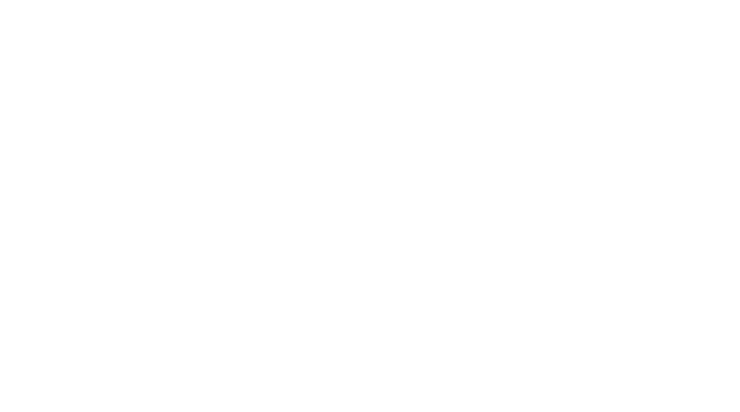
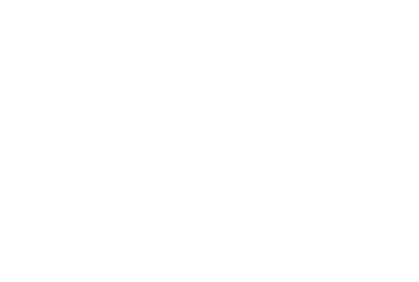

# tag_fs - A simple tag fileystem

A quick-and-dirty proof of concept tag filesystem designed as a primary filesystem
for an [OS project](https://github.com/last-genius/os_project/).
This filesystem was designed to tackle several problems inherent in hierarchical filesystems:
* **File names aren't unique, and file addressing is done by content first, name second.**
Files are unique and each modification recalculates its hash; names aren't unique and free
the user from worrying about duplicate files. No more `EEXIST`!
* **Soft and hard links are a non-problem due to name non-uniqueness**. Ordinary filesystems
complicate their interface with links: hard links can't link to files on different filesystems
and soft links might often break and lead to weird behavior when a program does not explicitly handle them.
* **Path to the file is not the way to find a file!** Hierarchical filesystems mix up
internal structure and user-exposed interfaces, we solve this with more intuitive systems.

## Design

The underlying filesystem is based on nodes which are separated into several classes:
* `FileNode` - contains the actual information about the file, its calculated hash
* `TagNode` - a 'directory' that contains several NameNodes
* `NameNode` - an i-node like node that holds a name and points to a node

This allows separation between different logical entities, files are therefore unique 
and might hold several names attached to them (links are thus a first-class concept), 
tags contain a list of files with a certain tag that aren't unique.



Files also link back to the name nodes pointing to them to allow for faster traversal 
after file modification and hash recalculation.



This underlying system is then connected to FUSE-provided interface to expose
it to the user.

## Installation

Make sure you have FUSE and libfuse installed, they're usually available in a package
called `fuse` in your default package manager. Install Rust too!

```
git clone https://github.com/last-genius/tag_fs
cargo build
```

## Usage

```
sudo target/debug/tag_fs $MOUNT_POINT

# Turn on debug logging
RUST_LOG="tag_fs::fs=debug" sudo -E target/debug/tag_fs /mnt/tagfs
```

## Progress

Designing the virtual filesystem to connect up with the OS!
